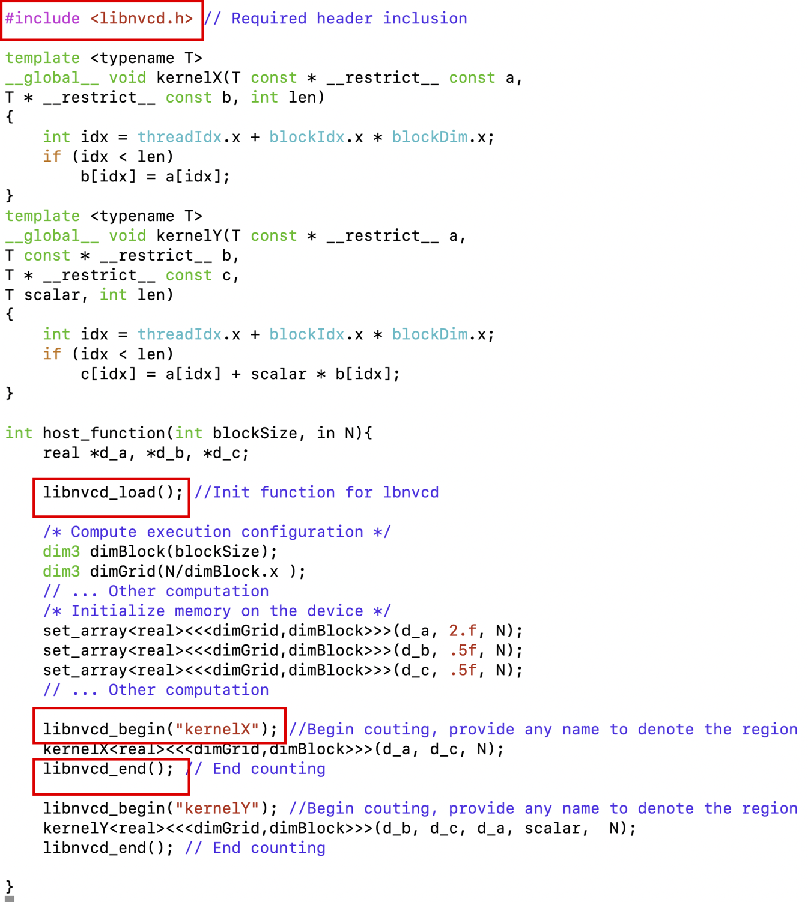

## libnvcd
This is an easy-to-use, performance measurement library for NVIDIA based GPUs and CUDA-based source codes. 

The annotation library queries CUPTI APIs for reading both events and metrics for functions or selected regions in a GPU (or CPU+GPU) code. As of now, the tool only reports the events and metrics that CUPTI provides. 

In the future, we will add a separate analysis module that combines these events and metrics to compute our own derived measurements.

<!--**This tool is actively being developed. We will try our best to keep the current API as is. However, there is no guarantee. Please use with caution.**-->

This repository consists of two primary tools:
* A Source-code annotation and interception library.
* A Standalone tool, for automatically finding groups of counters available on a given firmware. 

## Example

#### Building

The code below produces a debug build for the hook library and the two executables `nvcdinfo` and `nvcdrun`.

```
git clone https://github.com/tzislam/libnvcd.git &&\
cd libnvcd &&\
export CUDA_VISIBLE_DEVICES=0 &&\
export CUDA_HOME=/usr/local/cuda-10.1 &&\
export CUDA_ARCH_SM=sm_70 &&\
export LD_LIBRARY_PATH=$PWD/bin:$LD_LIBRARY_PATH &&\
make DEBUG=1 libnvcdhook.so nvcdinfo nvcdrun
```

The following assumptions are made:

- The user has a CUDA 10.1 install at `/usr/local/cuda-10.1`, with the following subdirectories available at the root of the installation
  - `include`
  - `lib`
  - `bin`
  - `extras/CUPTI`

- The GPU on the user's system supports CUDA architecture `sm_70`

The above script has the following consequences:

- These executables, and the shared library - `libnvcd.so` - which they depend on, will be built in the `bin` directory that lies at the root of the repo.

- Given that `DEBUG=1` is provided, optimizations are turned off and debug symbols are provided.

#### Running

###### nvcdinfo

First, we need to gather the appropriate group information for our device. 

In the root of the repository, execute the following:

```
export NVCDINFO_DEVICE_ID=0 &&\
export NVCDINFO_GROUP_SIZE=5 &&\
make nvcdinfo_generate_csv &&\
export BENCH_EVENTS=$(head -n1 cupti_group_info/device_0/domain_a.csv)
```

What this does:
- A a number of CSV files in the generated `cupti_group_info/device_0`directory. 
- Each CSV file is titled by its corresponding domain name, as queried via the CUPTI API. 
- The environment variable, `BENCH_EVENTS`, is set to the first line of the first domain CSV file. 
  - This will be a set of compatible groups that can be measured together in a single kernel invocation.

###### nvcdrun

We can now use `nvcdrun` as a test. 

In the repository root, execute the following:

```
export LD_PRELOAD=$LD_PRELOAD:$PWD/bin/libnvcdhook.so &&\
bin/nvcdrun
```
____

## Build Options

#### Syntax

`make [OPTIONS] TARGETS`

Where,

- `TARGETS` is one or more of the following:
  - `libnvcdhook.so`: the hooking library, which intercepts CUDA kernel invocations and drives the measurements.
  
  - `nvcdinfo`: a tool which queries GPU firmware to provide compatibility information on firmware-dependent event counters.

  - `nvcdrun`: a simple test which can be used to demonstrate the usage of the library.

- `OPTIONS` currently only supports the provision of debug builds. If desired, the user may specify `DEBUG=1`. Otherwise, optimizations are turned on.

### Prerequisites

- CUDA version 10.1 or higher.

The following environment variables need to be set, **before and after** compilation of the library:

- `CUDA_HOME`. This should point to the very root directory of the cuda installation.
- `CUDA_ARCH_SM`. This should be provided in the form of `sm_<version>`.
- `LD_LIBRARY_PATH`. This must point to the bin directory of the repostiory. It may also need to point to CUDA and CUPTI's locations.

The following environment variables need to be set, **after** compilation and **before** executing the binary which uses the annotated code.

- `LD_PRELOAD`. This needs to contain the path to `libnvcdhook.so`.

## How it works

- We hook the cuda API function, `cudaLaunchKernel()`.

- Each time a kernel is invoked, `cudaLaunchKernel()` is called.

- When `cudaLaunchKernel()` is called, libnvcd will only record event counters if the kernel invocation lies within an annotated region.

- `libnvcd_begin()` and `libnvcd_end()` mark the start and end of a region. 

- These functions are loaded at runtime through the hook's library, which is designed to be loaded using `LD_PRELOAD`. Thus, there is no need for the user to link directly against `libnvcd.so`.

- Region annotation may contain invocations for multiple kernels or a single kernel - it's up to the user. As is the name of the region itself.

- Whatever counters have been specified by the user will be recorded by a callback within `libnvcd.so` that interacts with the CUPTI Event and Callback APIs.

### How to use in a source code

We include an example in `nvcdrun/src/gpu_call.cu` showing how to annotate an application using libnvcd API calls. 

The figure below shows that `libnvcd_load` (the initialization function), `libnvcd_begin` and `libnvcd_end` functions are called from the host function.

The begin and end functions can encompass several kernel calls. In that case, libnvcd aggregates collected samples across all kernels between the begin and end calls.



### nvcdinfo

You can first use `nvcdinfo` to determine what counters are available on the system.

`nvcdinfo` will spit out csv files for each event domain that the GPU has available. The simplest approach is to take one of the lines in the CSV file and use that line as the event counters you wish to record.

### BENCH_EVENTS

By using the desired line of event counters and setting them as the value to the `BENCH_EVENTS` environment variable, each counter will be recorded. 

For example, on some systems the following line will be present in one of the CSV files:

`branch,divergent_branch,threads_launched,warps_launched`

Simply taking this line and setting it as follows is enough:

`export BENCH_EVENTS=branch,divergent_branch,threads_launched,warps_launched`

The reason why we group these accordingly is because only a very specific set of events may be used together at once. Only one of these event groups can be recorded per kernel invocation, so it's simplest to stick with recording on a per-line basis. That said, the library does support the usage of incompatible events and will find separate groups to section them off with.

### Source code

From there, make sure to add `-I/path/to/libnvcd-repo/include` to your cpreprocessor flags, `#include <libnvcd.h>` on any source files with cuda calls you wish to use, and then call `libnvcd_init()`. This will load `libnvcd_begin()` and `libnvcd_end()`. From there, mark your regions and you'll get output.

See `nvcdrun/src/gpu_call.cu` for an in source example.

<!-- ## Current limiations -->

### Not yet implemented

- `nvcdinfo` only provides information on event counters, not metrics.

### IBM LSF, JSM

The systems that this library has been tested on primarily are HPC clusters that are built off of IBM's LSF, and use the `jsrun` resource allocation command to perform work.

We've experienced some issues with `jsrun` on one machine so far, but on the other the issue is non-existent. Launching an interactive session and ensuring that you have private access to all available GPUs on the node should be sufficient to get work done. 

### CUDA_VISIBLE_DEVICES

If it is the case that you do _not_ have access to all GPUs, you can set the environment variable `CUDA_VISIBLE_DEVICES` to the ID of the GPU you wish to use. This will _map_ the physical ID of the GPU to a "virtual" ID of 0 that is known and used by the program.

It is recommended that, for now, you use 1 GPU per invocation and use `CUDA_VISIBLE_DEVICES` to control which GPU is in use. 

For example, if the machine you're working on has 4 GPUs available, each numbered 0-3, and you do:

`export CUDA_VISIBLE_DEVICES=1`, and then run `nvcdrun`, it will only see the device ID'd through index 1 on the GPU array. As far as the CUDA driver is concerned, querying for GPU 0 will actually return GPU 1.

## Using the standalone query tool for listing all possible groups of events and metrics to list

The standalone tool `nvcdinfo` can be used to automatically put the metrics and events into groups of user-specified sizes. 

 Not all metrics or events can be collected together due to hardware resource conflicts. This tool helps address this issue -- it automatically generates groups of events that **can** be collected together.

#### Usage

`./nvcdinfo [-n GROUP_SIZE] -d DEVICE_ID`

Where,

- `DEVICE_ID` is the GPU id, which should be between 0 and 3.

- `GROUP_SIZE` is the amount of counters that will be used for each group. (optional)

The command generates a list of events for DEVICE_ID. Each entry in the output will pertain to a group of events that can be counted together in a single kernel invocation.

This does not guarantee that each group will indeed have all of the `GROUP_SIZE` number of events: the actual number of events per group depends on the availability of that many events per group. 

By default, `GROUP_SIZE` is set to 1, meaning one metric per group. We recommend using a large value for `GROUP_SIZE`, such as 100. This ensures the largest possible groups will be used, and thus reduces the number of passes needed to cover collecting all events.

#### Notes

- `DEVICE_ID` should have a direct correspondance with the environment set by `CUDA_VISIBLE_DEVICES`. For example, if `CUDA_VISIBLE_DEVICES=2,3`, then the IDs which should be valid will be either 0 (for device `2`) or 1 (for device `3`). 

- In the future, metric support is planned.

<!--
Usage 2: 
./nvcdinfo [-n GROUP_SIZE] -d DEVICE_ID -e
Generates a list of events for DEVICE_ID (i.e., gpu id. For a node with 4 gpus, DEVICE_ID will be between 0 and 3 inclusive). Each entry in the output will pertain to a group of events that can be counted and each group will have at most GROUP_SIZE number of events. This does not guarantee that each group will indeed have all of the GROUP_SIZE number of events. The actual number of events per group depends on the availability of that many events per group. The flag "-e" means the user wants to list all events. By default, the GROUP_SIZE is set to 1, meaning one event per group. We recommend using a large value for GROUP_SIZE, such as 100 to ensure the largest possible groups to reduce the number of passes needed to cover collecting all events.

Usage 3: 
./nvcdinfo -d DEVICE_ID -m
Generates a list of all metrics and the events used to calculate those metrics for DEVICE_ID (i.e., gpu id. For a node with 4 gpus, DEVICE_ID will be between 0 and 3 inclusive). This map of metrics to events can be useful for postprocessing later.
-->

## Output format

## What is not recorded by this tool

We currently support collecting metrics and events. Metrics are specified in the exact same way events are, but through the `BENCH_METRICS` environment variable.

Soon we will provide better auxilary support by enabling `nvcdinfo` to report on groups of metrics. That said, if you know what metrics are available on your system, you will get the information that you seek by setting `BENCH_METRICS` accordingly.


## How to cite this work
Please use the following citation:
```
@Misc{holland20libnvcd,
  title =        {libNVCD: A per-thread hardware performance counter measurement tool for GPUs},
  author = {Schutte, Holland and Islam, Tanzima Z.},
  year = {2020},
  note =         {\url{https://github.com/tzislam/libnvcd}}
}
```
